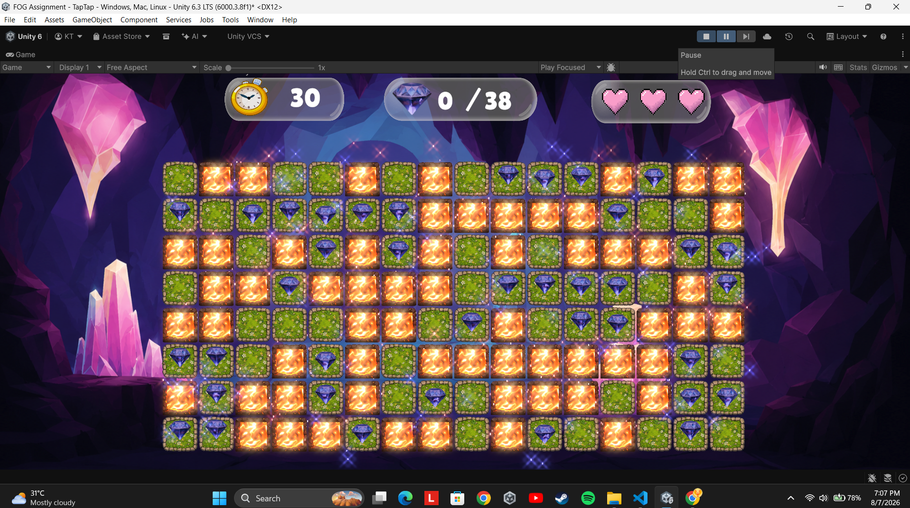
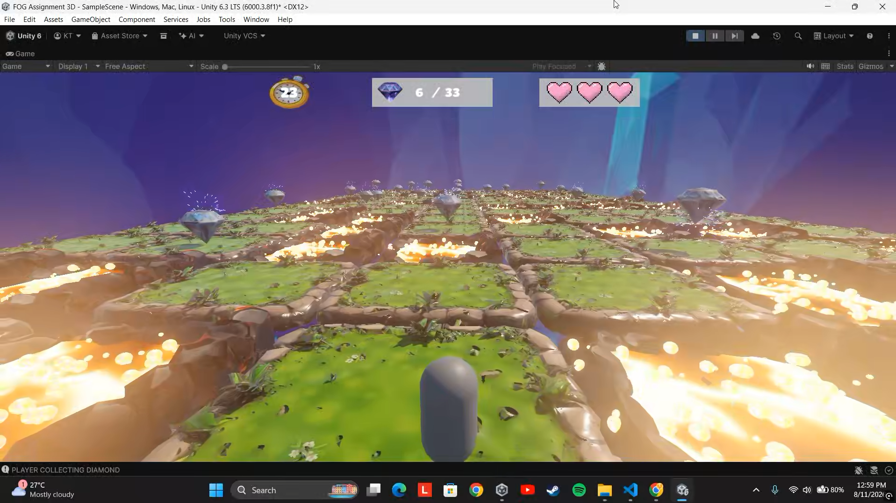

# FOG Assignment — Diamond Collect

## 2D Version — Main Assignment

- 🎮 **Playable Build:** [Google Drive Link](https://drive.google.com/drive/folders/1ueXWy6d37PmycWu0ad_s4lfu3HllqI83?usp=drive_link)
- 🎥 **Gameplay Demo:** [YouTube Video](https://youtu.be/q0bQE2kzf3Y)
- 💻 **Source Code:** [GitHub Repository](https://github.com/Kaushal-Teraiya/Diamond-Collect)

The 2D version is the **main required submission** for the assignment.

---

## 3D Version — Bonus

- 🎮 **Playable Build:** [Google Drive Link](https://drive.google.com/drive/folders/1ueXWy6d37PmycWu0ad_s4lfu3HllqI83?usp=drive_link)
- 🎥 **Gameplay Demo:** [YouTube Video](https://youtu.be/vbek4wB_ywo)
- 💻 **Source Code:** [GitHub Repository](https://github.com/Kaushal-Teraiya/Diamond-Collect-3D)

The 3D version is a **bonus implementation** exploring the same gameplay concept with third-person, jump-based tile traversal.